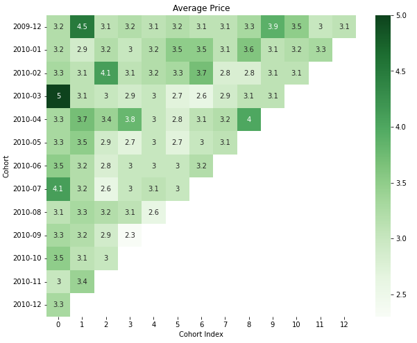

# Cohort Analysis for Online Store

Conducted a cohort analysis for a real online retail store data set (n=525461). This `Online Retail II` data set contains all the transactions occurring for a UK-based and registered, non-store online retail between 01/12/2009 and 09/12/2011. The company mainly sells unique all-occasion gift-ware. Many customers of the company are wholesalers. Column values can be found [here](https://archive.ics.uci.edu/ml/datasets/Online+Retail+II) under the Attribute Information section.

The whole project report can be found [here](./analysis.ipynb).

## Motivaiton

Conducting cohort analyses allows you to understand customers behaviors more in-depth by gathering insights such as product engagement, retention rate, lifetime value that are difficult to see from raw datasets. With visualizations, cohort analyses can be extremely useful tools to clearly see how customers behave over time. 

## Project Goals

- Grouping customers based on the month in which they made the first payment
- What are the retention rates for each cohort in subsequent months?
- What are the average product quantities purchased for each cohort in subsequent months?
- What are the average product prices purchased for each cohort in subsequent months?

## Data Cleaning

For a successful cohort analysis, revenue data, initial payment date, and unique identifier such as customer id are required. Thus, rows with missing one of these values should be filtered out before diving into analysis. The following rows are dropped.

1. Rows with missing `Customer ID` values: n=107927.
2. Duplicated rows: n=6331.
3. Rows with negative value for product quantity or price: n=9816.

The final data frame contains approximately 401,000 rows.

## Cohort Analysis

1. Specify each customer's cohort with truncated date value.
2. Count the unique number of customers per cohort and order month.
3. Compute the month difference bewteen initial payment date and other order dates for each customer.

With the given data frame that is grouped by cohort, we can now conduct three different types of analysis: rentention, average quantity purchased, and average purchased product price.

The first column (Cohort index of 0) will always be 100% since it divides by itself (the size of each cohort). Notice the first cohort (2009-12) has high retention (~30-40%) rate compared to that of other cohorts and there's a peak at the 11th month (50%) which potentially indicates the seasonal shopping crowd.

We can observe a couple of outliers in the heatmap above. This is possibily due to marketing campaigns such as sale, clearance, etc. Fortunately, customers keep buying ceratin amount of products. Notice first 5 cohorts. Once they make a payment, they also buy certain quantities in subsequent months, except for cohort 2010-09. The irregular peak of 27 might be due to a one-time marketing campaign and it turns out that campaign was not successful.

There are several cohort index for certain cohorts where the average price of purchased items are particularly higher than that of others. We defintely would like to know what advertisement / marketing campaign was proceeded at that time period so that we can invest more in those.

## References

- [A Complete Guide to Revenue Cohort Analysis in SQL and Python](https://towardsdatascience.com/a-complete-guide-to-revenue-cohort-analysis-in-sql-and-python-9eeecd4c731a)
- [Cohort Analysis with Python](https://www.kaggle.com/code/ahmetokanyilmaz/cohort-analysis-with-python)
- [Understanding Customer Retention Rates with Cohort Analysis using Python and Seaborn](https://yuanyexi.medium.com/understanding-customer-retention-rates-with-cohort-analysis-using-python-and-seaborn-5da6ea015935)
